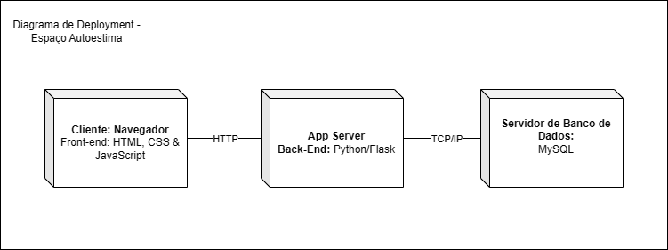

# 🚧 Sistema de agendamento - Em construção... 🚧
Aplicação desenvolvida especificamente para uma clínica de estética chamada "Espaço Autoestima" que visa o cadastro e agendamento de clientes com suas respectivas sessões, horário e os(as) profissionais que irão tratá-los. Assim como, cadastro de produtos que serão utilizados nas sessões, controle de estoque, entre outros. Esse projeto se refere à disciplina de "Software Product: Analysis and Specification" do 4° semestre do curso de Análise e Desenvolvimento de Sistemas da Faculdade Impacta.

## Tabela de conteúdos
   * [Integrantes](#-integrantes)
   * [Tecnologias](#️-tecnologias)
   * [Modelagem de negócios - Diagrama de classes](#-modelagem-de-negócios---diagrama-de-classes)
   * [Diagrama de arquitetura ou deployment](#diagrama-de-arquitetura-ou-deployment)
        * [Vantagens](#vantagens)
   * [Execução da aplicação](#-execução-da-aplicação)
   * [Contribuição](#-contribuição)

## 🧑 Integrantes
- Anderson Tengan Amador;
- David Castanheira de Souza;
- Letícia Nunes de Lima;
- Lucas Stefaneli

## ⚒️ Tecnologias 
A linguagem back-end responsável pelas regras de negócio e lógica da aplicação em questão é o **[Python](https://docs.python.org/pt-br/3/tutorial/)**:
* O framework web utilizado é **[Flask](https://flask.palletsprojects.com/en/3.0.x/)** que permite que a construção de aplicações Web de maneira simples e objetiva com a capacidade de escalar para aplicações complexas;
* Neste projeto, utilizamos esse framework para criar páginas web dinâmicas através de rotas, pois facilita a criação de endpoints e a integração com bancos de dados, tornando o desenvolvimento do backend eficiente e organizado;
* Para a prototipação e design das telas do projeto, está sendo utilizado o **[Figma](https://www.figma.com/design/VEhO4SsuqNKRqIPCCrhl0K/Espaço-Autoestima-Prototipos?node-id=0-1&node-type=canvas&t=mEEwngDu1dxQ5xk9-0)**.

## ‍💼 Modelagem de negócios - Diagrama de classes

<!--  -->

* Agendamento: Representa um agendamento de um serviço. Possui atributos como data, horário, status e associações com cliente e profissional.

* Cliente: Representa o cliente/paciente do sistema. Possui atributos como nome, telefone, email e métodos para cadastro, consulta e atualização de dados;

* Disponibilidade: Representa a disponibilidade de um profissional em determinado horário. Possui atributos como data, horário e associações com profissional;

* Fornecedor: Representa o fornecedor dos produtos. Possui atributos como nome, telefone e a empresa a qual pertence;

* Procedimento: Representa um procedimento realizado. Possui atributos como nome, descrição e associações com consultas;

* Produto: Representa os insumos que são utilizados durante os procedimentos na clínica. Possui atributos como nome, data de validade, quantidade, marca, preço e descrição;

* Profissional: Representa um profissional que realiza os serviços. Possui atributos como nome, especialidade, CRM e métodos para cadastro, consulta e atualização de dados.

## Diagrama de arquitetura ou deployment



Ilustra como os diferentes componentes do sistema estão distribuídos em diversos nós (computadores) de uma rede.

É divido em 3 camadas ou componentes principais e suas respectivas atribuições:

* Cliente (Navegador): É a interface do usuário. Utiliza tecnologias web padrão (HTML, CSS, JavaScript) para apresentar a interface visual e interagir com o servidor;

* App Server: O coração do sistema, processa as requisições dos clientes, interage com o banco de dados e gera as respostas. Emprega Python e Flask para a lógica de negócio;

* Servidor de Banco de Dados: Armazena os dados do sistema (usuários, configurações, etc.) de forma persistente. Foi-se utilizado o MySQL para gerenciar esses dados.

### Vantagens
Escalabilidade: Cada componente pode ser escalado individualmente;

Manutenibilidade: A separação das camadas facilita a manutenção;

Flexibilidade: Permite o uso de diferentes tecnologias;

Segurança: A separação entre cliente e servidor permite implementar medidas de segurança mais eficazes.

## 🚀 Execução da aplicação
Para executá-la localmente, é preciso se certificar de que o **[Docker](https://www.docker.com/products/docker-desktop/)** está instalado na sua máquina. Para isso (caso esteja utilizando Windows), é necessária a instalação do [Windows Subsystem Linux]([https://learn.microsoft.com/pt-br/windows/wsl/install]):

Primeiramente, acesse a pasta do projeto no terminal ou CMD
```
cd aplicacao-clinica
```

Feito isso, execute o comando abaixo:
```
docker compose up -d
```
Em caso de uma eventual alteração ou restabelecimento respectivamente:
```
docker compose stop
docker compose down 
```

## 🤝 Contribuição
Contribuições são sempre bem-vindas! Se você tiver ideias para melhorar este projeto, sinta-se à vontade para abrir uma issue ou enviar um pull request.